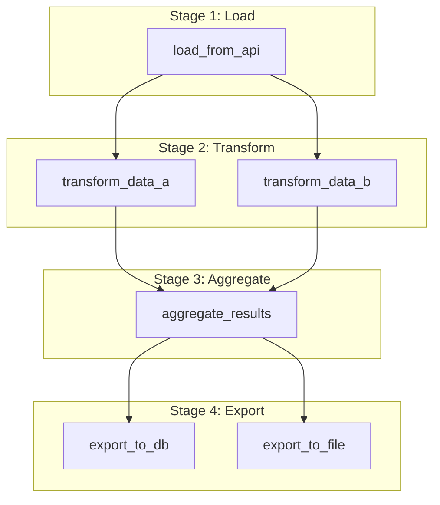

# th2etl
thaink2 in house built ETL and automatisation library

## Design

A pipeline is modeled as a series of stages, where each stage contains one or more blocs.

- **Stages** are executed sequentially. The next stage only begins after all blocs in the current stage have completed successfully.
- **Blocs** within the same stage are executed in parallel, allowing for significant performance improvements for independent tasks.

The execution flow is defined by the structure of the `stages` list in the pipeline's definition.

### Pipeline Structure

A pipeline's structure is defined as a list of stages. Each stage is a list of bloc names that will be executed in that stage.

-   **Sequential Stages**: The stages are executed in the order they appear in the list. The pipeline will not proceed to the next stage until all blocs in the current stage have completed successfully.
-   **Parallel Blocs**: All blocs within a single stage are executed concurrently.

This model provides explicit control over both sequential and parallel execution steps in your ETL process.

**Example Structure:**

A pipeline defined with the following stages:

```json
[
    ["load_from_api"],
    ["transform_data_a", "transform_data_b"],
    ["aggregate_results"],
    ["export_to_db", "export_to_file"]
]
```

...will have the following execution flow:

**Execution Flow Diagram:**



### Blocs

Each bloc is one of:

- `LoaderBloc` — loads or extracts raw data.
- `TransformerBloc` — transforms data between stages.
- `ExporterBloc` — exports or writes output.

Data is passed between blocs via a shared `RunContext` object, which acts as an in-memory data store for the duration of a pipeline run.

### Loader Blocs

The following loader blocs are available:

- `CsvLoaderBloc`: Loads data from a CSV file.
    - `bloc_type`: `csv_loader`
    - **Config**:
        - `file_path` (required): The path to the CSV file.
        - `delimiter` (optional): The delimiter character (default: `,`).
- `PostgresLoaderBloc`: Loads data from a PostgreSQL database.
    - `bloc_type`: `postgres_loader`
    - **Config**:
        - `table_name` (required): The name of the table to load.
        - `schema` (optional): The database schema.
- `ApiLoaderBloc`: Loads data from a web API.
    - `bloc_type`: `api_loader`
    - **Config**:
        - `url` (required): The API endpoint URL.
        - `method` (optional): The HTTP method (default: `GET`).
        - `params` (optional): A dictionary of URL parameters.
        - `headers` (optional): A dictionary of HTTP headers.
        - `json` (optional): A dictionary for the JSON request body.

### Transformer Blocs

The following transformer blocs are available:

- `RunAdkAgentsBloc`: Runs an ADK agent via an API call.
    - `bloc_type`: `run_adk_agents`
    - **Config**:
        - `base_url` (required): The base URL of the agent API.
        - `agent_id` (required): The ID of the agent to run.
        - `user_id` (required): The user's ID for authentication.
        - `message_text` (required): The message to send to the agent.
- `RefreshWebhooksBloc`: Refreshes webhooks via an API call.
    - `bloc_type`: `refresh_webhooks`
    - **Config**:
        - `url` (required): The API endpoint for refreshing webhooks.
        - `user_id` (required): The user's ID for authentication.

### Exporter Blocs

The following exporter blocs are available:

- `PostgresExporterBloc`: Exports data to a PostgreSQL table.
    - `bloc_type`: `postgres_exporter`
    - **Config**:
        - `table_name` (required): The name of the destination table.
        - `source_bloc` (required): The name of the bloc providing the data to export.
        - `schema` (optional): The database schema.
        - `if_exists` (optional): How to behave if the table already exists (`fail`, `replace`, or `append`). Default is `replace`.

## API Service

The application includes a FastAPI-based API for managing resources.

To run the API server, use the `--serve-api` command:

```bash
th2etl --serve-api
```

You can also specify the host and port:

```bash
th2etl --serve-api --host 0.0.0.0 --port 8080
```

The API documentation will be available at `http://127.0.0.1:8000/docs` when the server is running.

When you run the API server, the scheduler manager will also start automatically in the background.

### Health Check

You can monitor the status of the service, including its connection to the database and the status of the scheduler, by sending a GET request to the `/health` endpoint.

```bash
curl http://127.0.0.1:8000/health
```

If the service is running and all components are healthy, it will return a `200 OK` response. If any component is down, it will return a `503 Service Unavailable` error.

## Usage

Run the scheduler as a standalone process:

```bash
python -m th2etl.runner
```

Run the scheduler in a separate isolated session:

```bash
python -m th2etl.runner --background
```

Pass environment variables into the isolated session:

```bash
python -m th2etl.runner --background --env SOURCE=prod --env DESTINATION=warehouse
```

If the package is installed, use the CLI entry point:

```bash
th2etl
```

This will start the scheduler by default.

To start the scheduler in the background:
```bash
th2etl --background
```

To start the API service in the background:
```bash
th2etl --serve-api --background
```

## Quickstart

Create pipeline metadata from the command line and then start the ETL service.

1.  Set your PostgreSQL database settings in environment variables:

    ```powershell
    $env:DATABASE_HOST = "localhost"
    $env:DATABASE_PORT = "5432"
    $env:DATABASE_NAME = "th2etl"
    $env:DATABASE_USER = "etl_user"
    $env:DATABASE_PASSWORD = "secret"
    ```

2.  Create blocs in the database:

    ```powershell
    python -c "from th2etl import DatabaseStorage; from th2etl.configs.settings import get_settings; s = get_settings();
    with DatabaseStorage.from_settings(s) as storage:
        storage.create_bloc('example_loader', 'csv_loader', config={'file_path': 'data.csv'})
        storage.create_bloc('transformer_a', 'example_transformer', config={'factor': 2})
        storage.create_bloc('transformer_b', 'example_transformer', config={'factor': 3})
        storage.create_bloc('example_exporter', 'postgres_exporter', config={'table_name': 'processed_data', 'source_bloc': 'transformer_a'})"
    ```

3.  Create a trigger for your pipeline:

    ```powershell
    python -c "from th2etl import DatabaseStorage; from th2etl.configs.settings import get_settings; s = get_settings();
    with DatabaseStorage.from_settings(s) as storage:
        storage.create_trigger('every_hour', 'example_pipeline', '0 * * * *')"
    ```

4.  Create the pipeline with stages for parallel execution:

    ```powershell
    python -c "from th2etl import DatabaseStorage; from th2etl.configs.settings import get_settings; s = get_settings();
    with DatabaseStorage.from_settings(s) as storage:
        stages = [
            ['example_loader'],
            ['transformer_a', 'transformer_b'],
            ['example_exporter']
        ]
        storage.create_pipeline('example_pipeline', stages=stages)
        storage.create_scheduler('example_scheduler', 'example_pipeline', 'every_hour')"
    ```

5.  Start the ETL service:

    ```bash
    th2etl
    ```

## Persistent Storage

Use `DatabaseStorage` to persist bloc, pipeline, trigger, and scheduler definitions.

```python
from th2etl import DatabaseStorage
from th2etl.configs.settings import get_settings

settings = get_settings()
with DatabaseStorage.from_settings(settings) as storage:
    storage.create_bloc("example_loader", "csv_loader", config={"file_path": "data.csv"})
    storage.create_bloc("transformer_a", "example_transformer", config={"factor": 2})
    storage.create_bloc("transformer_b", "example_transformer", config={"factor": 3})
    storage.create_bloc("example_exporter", "postgres_exporter", config={"table_name": "processed_data", "source_bloc": "transformer_a"})
    
    stages = [
        ["example_loader"],
        ["transformer_a", "transformer_b"],
        ["example_exporter"],
    ]
    storage.create_pipeline("example_pipeline", stages=stages)
    storage.create_trigger("every_hour", "example_pipeline", "0 * * * *")
    storage.create_scheduler("example_scheduler", "example_pipeline", "every_hour")

    print(storage.list_pipelines())
    print(storage.list_schedulers())
```

The `Settings` object reads database connection details from environment variables such as `DATABASE_HOST`, `DATABASE_PORT`, `DATABASE_NAME`, `DATABASE_USER`, `DATABASE_PASSWORD`, and optionally `DATABASE_SSL_MODE`. You can also provide `DATABASE_URL` directly.

## Scheduler

Use `CronTrigger` and `CronScheduler` to run a pipeline on a cron-like schedule:

```python
from th2etl.pipelines import build_example_pipeline
from th2etl.scheduler import CronScheduler, CronTrigger

pipeline = build_example_pipeline()
trigger = CronTrigger("*/5 * * * *")
scheduler = CronScheduler(pipeline, trigger)
scheduler.start()
```

For multiple pipelines with independent trigger schedules, use `SchedulerManager` so each pipeline can run on its own cadence in parallel:

```python
from th2etl.pipelines import build_example_pipeline
from th2etl.scheduler import CronTrigger, CronScheduler, SchedulerManager

pipeline1 = build_example_pipeline()
pipeline2 = build_example_pipeline()

scheduler1 = CronScheduler(pipeline1, CronTrigger("0 * * * *"), name="hourly_pipeline")
scheduler2 = CronScheduler(pipeline2, CronTrigger("*/5 * * * *"), name="five_minute_pipeline")

manager = SchedulerManager([scheduler1, scheduler2])
manager.start()
```

If you persist scheduler metadata in the database, load scheduled pipelines dynamically from `DatabaseStorage`:

```python
from th2etl import DatabaseStorage
from th2etl.configs.settings import get_settings
from th2etl.scheduler import load_scheduler_manager

settings = get_settings()
with DatabaseStorage.from_settings(settings) as storage:
    manager = load_scheduler_manager(storage)
    manager.start()
```

Or create a scheduler helper directly:

```python
from th2etl.pipelines import build_example_pipeline
from th2etl.scheduler import schedule_pipeline

pipeline = build_example_pipeline()
scheduler = schedule_pipeline(pipeline, "0 * * * *")
scheduler.start()
```

## Logging

The application uses Python's standard `logging` module. You can control the log verbosity and output location using environment variables.

### Environment Variables

- `LOG_DIR`: If set to a path (e.g., `logs`), separate log files will be created in that directory for each main module (`scheduler.log`, `api.log`, etc.), along with a general `th2etl.log` file.
- `LOG_LEVEL`: Sets the global log level. Defaults to `INFO`. Can be set to `DEBUG`, `INFO`, `WARNING`, `ERROR`.
- `LOG_LEVELS`: Provides fine-grained control over different parts of the application. This is a comma-separated list of `logger_name:LEVEL`.

### Example Usage

To save logs to a `logs` directory with separate files for each module, you can set the following environment variables:

```bash
export LOG_DIR="logs"
export LOG_LEVELS="th2etl.scheduler:INFO,th2etl:WARNING"
```

This configuration will:
- Create a `logs` directory.
- Create log files like `scheduler.log`, `api.log`, and `th2etl.log` inside it.
- Log detailed messages from the scheduler to `scheduler.log`.
- Only show warnings and errors from other modules in their respective files and the console.

## Output Storage

When pipelines are run by the scheduler, their output can be stored in a directory for later review.

- `pipelines_logs_dir`: Set this environment variable to the path of a directory where you want to store the output of each pipeline run.

If this variable is set, a new subdirectory will be created for each run, named with the scheduler and a timestamp (e.g., `five_minute_scheduler/20260515_103000`). This folder is passed to the pipeline in the `RunContext`, and blocs can be designed to write their output there.

## API Client

A generic `HttpClient` is available in `th2etl.helpers.client` to simplify making API calls to external services.

### Usage

You can create a client for any service by providing its base URL.

```python
from th2etl.helpers.client import HttpClient

# Create a client for the JSONPlaceholder API
client = HttpClient(base_url="https://jsonplaceholder.typicode.com")

# Make a GET request
posts = client.get("/posts")
print(f"Found {len(posts)} posts.")

# Make a POST request
new_post = {
    "title": "foo",
    "body": "bar",
    "userId": 1,
}
created_post = client.post("/posts", json_data=new_post)
print(f"Created new post with ID: {created_post['id']}")
```

You can also include an authentication token when creating the client:

```python
secure_client = HttpClient(
    base_url="https://api.example.com",
    auth_token="your-secret-token"
)
```

### th2etl API Client

A dedicated client for the `th2etl` API is available in `th2etl.helpers.th2etl_client`. This client provides convenient methods for all the API's endpoints.

```python
from th2etl.helpers.th2etl_client import Th2etlClient

client = Th2etlClient()

# Check the health of the service
health = client.health_check()
print(f"Service status: {health['status']}")

# Create a new bloc
new_bloc = client.create_bloc(
    name="my-new-bloc",
    bloc_type="csv_loader",
    config={"file_path": "data.csv"},
)
print(f"Created bloc: {new_bloc}")

# List all pipelines
pipelines = client.list_pipelines()
print(f"Found {len(pipelines)} pipelines.")
```
